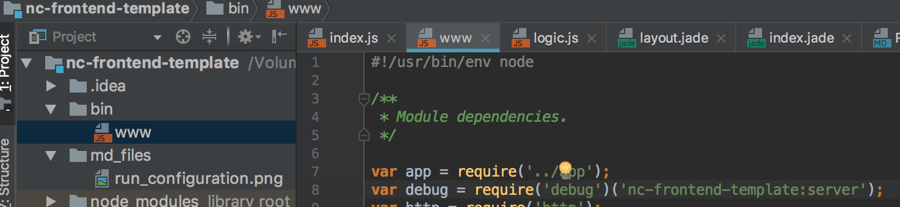
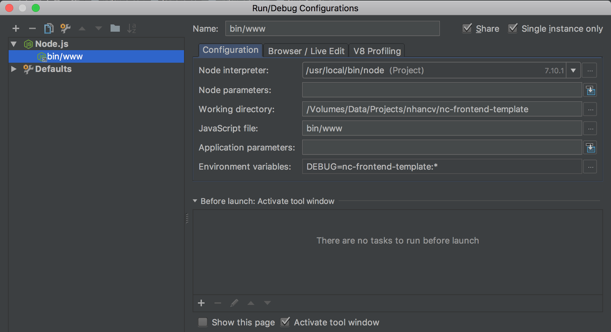

## Installation
-----------

- Install dependencies
`npm install`

- Check at `bin/www` line `var debug = require('debug')('nc-frontend-template:server');` same name with project name

- Create run configuration

